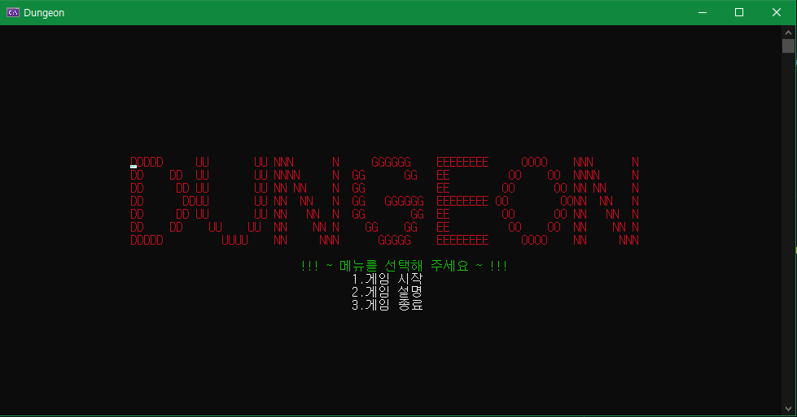
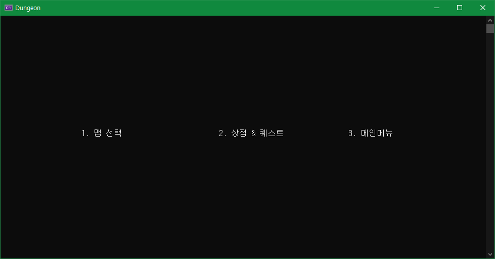
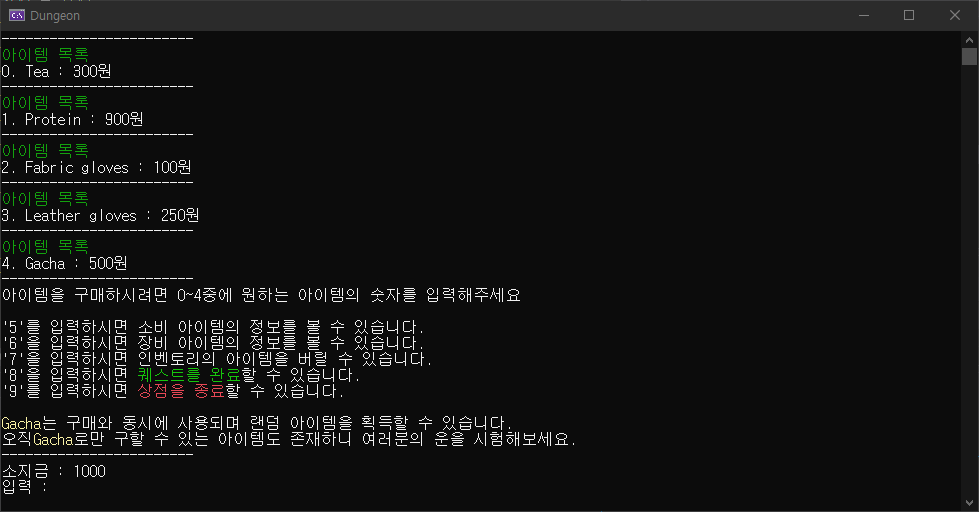
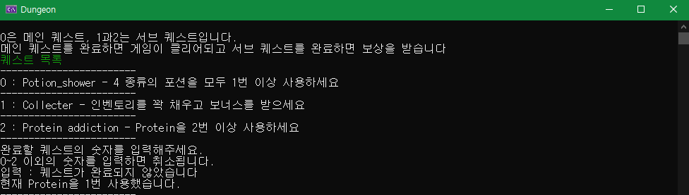
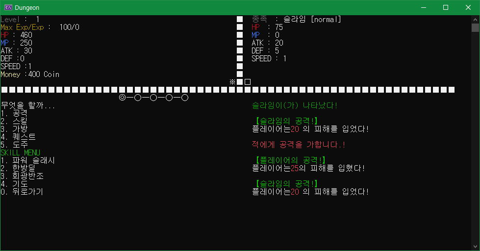
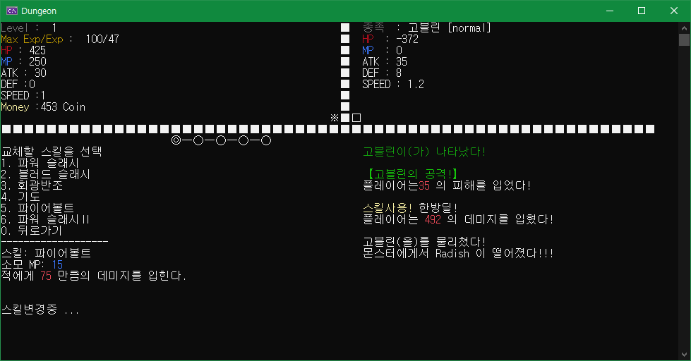
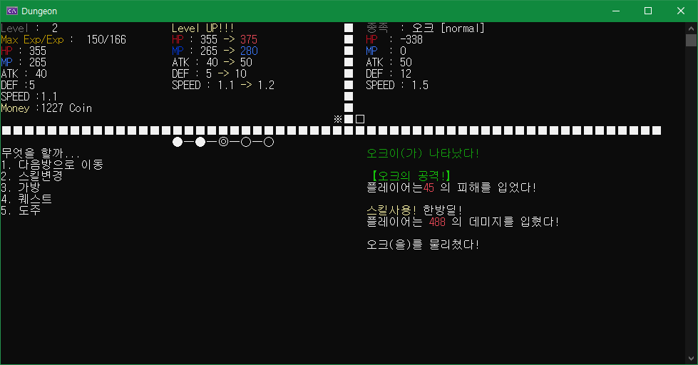
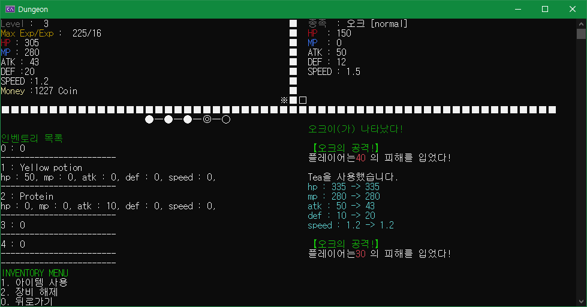
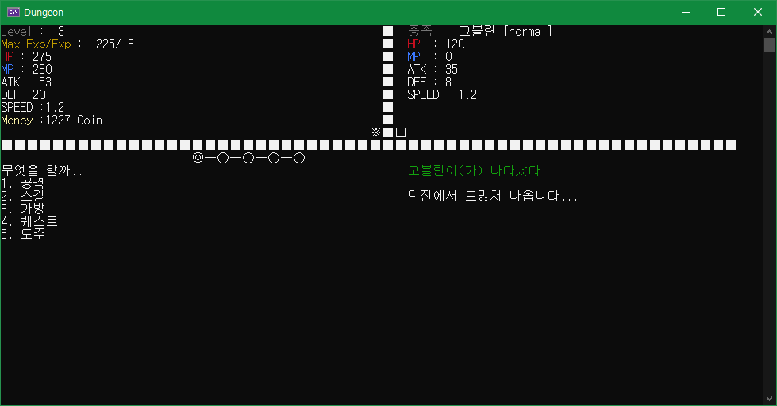

# DUNGEON 프로젝트

>**주제** : C++ 기반 RPG 턴제 게임

+ 맵 & 전투방식
  + 총 3개의 맵으로 구성되어, 맵 상의 몬스터들과 전투해 나가는 방식입니다.
  + 하나의 맵은 총 5개의 방으로 이루어져 각각 1~2마리의 몬스터가 등장합니다.
  + 마지막 5번째 방에는 보스가 등장합니다.
  + 전투는 간단하게 공격, 스킬 메뉴를 선택하여 진행합니다.
  + 캐릭터, 몬스터 스텟인 SPEED는 선제공격의 결정 요소가 됩니다. (즉, SPEED 스텟이 더 높은 쪽이 선제공격을 가져갑니다.)
  + 방 클리어 시, 한번 쉬어갈 수 있도록 '방 쉬기' 기능이 있습니다. 이때는, 다음 방으로 넘어가기 전 소비 아이템을 사용하여, 회복하거나 장비 & 스킬들을 정비할 수 있습니다.
  + 전투도중 가방 내에서 소비 아이템을 사용하거나 도주함으로써, 위험한 상황을 모면할 수 있습니다.
  
+ 인벤토리 & 상점
  + 몬스터는 사망 시에, 아이템을 드랍하게 되는데 드랍한 아이템을 가방에 보관할 수 있으며, 가방은 최대 5개의 아이템(소비&장비)만을 수용합니다. 장비는 가방 내에서 착용 & 해제가 가능합니다.
  + 상점에서는 총 5개의 아이템이 진열되는데, 5번째 아이템은 Gacha(가챠)로 랜덤 뽑기가 가능합니다.
  
+ 클리어 조건
  + 모든 메인 퀘스트 클리어 시, 게임도 클리어 됩니다. 다만, 캐릭터 사망 시 게임오버 됩니다.
  + 퀘스트 완료는 '상점 & 퀘스트'에서 할 수 있습니다.

## Contents

- [Features](#Features)
- [Execution Screens](#Execution-Screens)
- [Summary Notes](#Summary-Notes)

## Features 
> Click Notion icon

+ 메인화면 & 메뉴
  + 게임 설명 기능
  + 게임 종료 기능
  + 메뉴 진입 & 뒤로 가기 기능
  + 맵 선택 구현
  
+ 상점 & 퀘스트
  + 아이템 구매 기능
  + 가챠 품목 구현
  + 소비 아이템 정보 보기
  + 장비 아이템 정보 보기
  + 아이템 버리기 기능
  + 아이템 저장 기능
  + 퀘스트 완료 기능
  + 해당 작업 취소 구현
  + 상점 종료 기능

+ 전투
  + 일반 공격, 스킬 사용 기능
  + 스킬 변경 기능
  + 가방에서의 아이템 사용 기능
  + 현재 착용 중인 장비 해제 기능
  + 퀘스트 진행도 확인 구현
  + SPEED에 따른 공격선점 구현
  + 레벨 업 구현
  + 일정 확률로 아이템 드랍 구현
  + 몬스터 수준에 따른 돈 드랍률 구현
  + 방 클리어 시, 한번 쉬어갈 수 있도록 '방 쉬기' 기능
  + 해당 맵 재 진입 시, 몬스터 스탯 초기화 기능
  + 게임 오버 & 클리어 구현
  + 도주 기능

+ UI
  + 방 표시 구현 -> 남은 방: ○, 현재 진행 중인 방: ◎, 클리어 된 방: ●
  + 턴 표시 구현 -> ※: 현제 턴인 쪽, □: 현재 턴이 아닌 쪽
  + 내 진영, 상대 진영 구분
  + 몬스터 처지 & 특정 핻동 & 해당 내용 넘어갈 시, 콘솔 창 클리어 구현

## Execution Screens

> 메인화면

> 메뉴화면

> 상점 & 퀘스트화면

> 전투

## Summary Notes
> Click Notion icon

#### 상세소개: 

#### 협업 워크스페이션 & 기능정리: 
